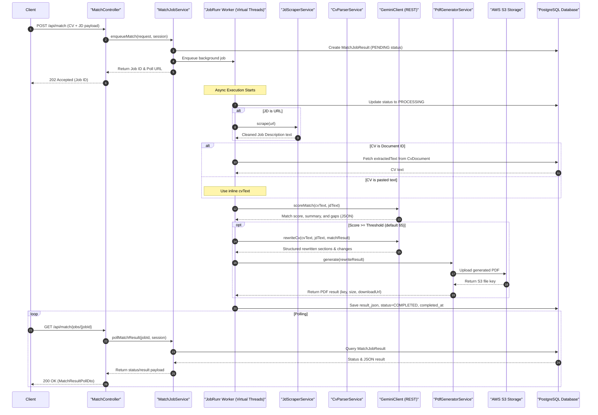
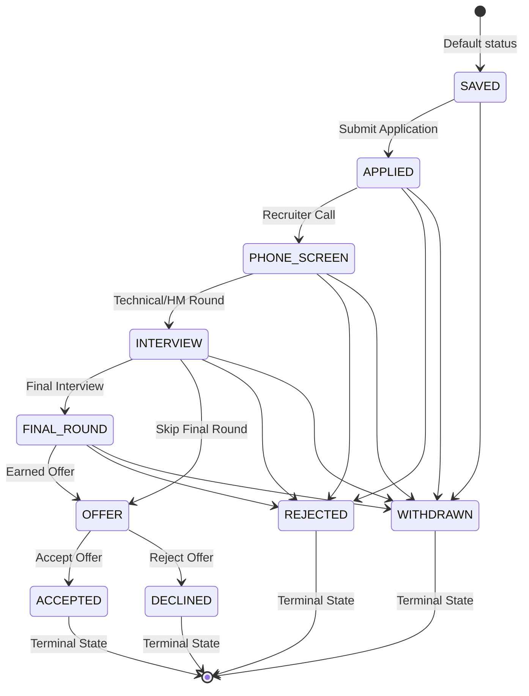

# SyncRes — AI-Powered CV Matcher & Job Application Tracker

[](https://openjdk.org/)
[](https://spring.io/projects/spring-boot)
[](https://www.postgresql.org/)
[](https://aws.amazon.com/s3/)
[](https://www.jobrunr.io/)
[](https://ai.google.dev/)

SyncRes is a high-performance, enterprise-grade Spring Boot backend application designed to streamline the job application lifecycle. It leverages state-of-the-art Generative AI (Google Gemini 3.1 Pro) to perform deep semantic mapping between candidate CVs and Job Descriptions (JDs), automatically generates customized resumes tailored to specific roles without fabricating information, and tracks candidate progress via a formal, audited state machine.

---

## 🚀 Key Features

*   🎯 **AI-Driven Match Scoring & Gap Analysis**: Semantically maps CV contents to Job Descriptions, calculating an overall match score (0–100) and producing a detailed gap report (matched skills, missing skills, and weak matches with explanations).
*   🔄 **Asynchronous Job Execution**: Decouples long-running AI analysis and PDF generation into background jobs managed by **JobRunr**, utilizing Java 21 Virtual Threads for high concurrency.
*   📝 **Smart CV Resume Retailoring**: If a match meets or exceeds a configurable threshold (default: 65), the system prompts Gemini to rewrite and reorder resume bullet points and professional summaries to highlight relevant experience.
*   📄 **ATS-Friendly PDF Generation**: Dynamically compiles the retailored CV data into valid, highly legible XHTML using Thymeleaf templates, and renders it to a single-column PDF using **Flying Saucer** (xhtmlrenderer) and **OpenPDF**.
*   🔒 **Secure & Tamper-proof Downloads**: Uploads original and generated resumes to **AWS S3** and exposes them via time-limited, signed URLs protected by **HMAC-SHA256** signatures.
*   📊 **Lifecycle Tracking (State Machine)**: Tracks job applications through a defined state machine with transactional, audited transition logs and lets users attach notes (interview prep, follow-ups, recruiter contacts).
*   🌐 **Hybrid Authentication Access Model**: Supports anonymous sessions for simple matching jobs while protecting administrative features (upload storage, tracking lists, stats, downloads) with **Spring Security** and stateless **JWT** tokens.
*   📧 **OTP Email Lifecycle**: Sends asynchronous SMTP verification and password-reset emails using secure, BCrypt-hashed 6-digit One-Time Passwords (OTPs).

---

## 🛠️ Technology Stack

| Component | Technology | Version | Description |
| :--- | :--- | :--- | :--- |
| **Core Framework** | Spring Boot | `3.5.0` | Backend foundation with Virtual Threads (`spring.threads.virtual.enabled=true`) |
| **Database** | PostgreSQL | `16` | Relational storage for user accounts, applications, tracking history, and session tokens |
| **Migrations** | Flyway | Built-in | Schema versioning and table migrations (`V1` to `V8`) |
| **AI Integration** | Google Gemini API | `gemini-3.1-pro` | LLM REST integrations for scoring, gap reporting, and resume rewriting |
| **Job Queue** | JobRunr | `7.2.2` | Background scheduler and task runner using Postgres database storage |
| **File Storage** | AWS SDK (S3) | `2.31.68` | Cloud storage wrapper for CV documents and generated PDFs |
| **Parser Tools** | Apache PDFBox / Apache POI | `3.0.3` / `5.3.0` | Extraction of raw text from PDF and DOCX/DOC documents |
| **Web Scraper** | Jsoup | `1.18.1` | Cleans and extracts semantic text from external Job Description URLs |
| **PDF Renderer** | Flying Saucer / OpenPDF | `9.8.0` / `2.0.3` | Converts Thymeleaf-rendered XHTML templates into print-ready PDFs |
| **Security** | Spring Security / JJWT | `0.12.6` | Stateless JWT authentication, CORS filters, and HMAC-SHA256 signature verification |

---

## 📐 System Architecture

### Match Job Flow (Asynchronous)

When a client submits a CV and Job Description for matching, the server enqueues a background job and returns immediately to keep the client interactive. The following diagram shows how the match job is processed:

![Match Job Flow](https://mermaid.ink/img/c2VxdWVuY2VEaWFncmFtCiAgICBhdXRvbnVtYmVyCiAgICBwYXJ0aWNpcGFudCBDbGllbnQKICAgIHBhcnRpY2lwYW50IENvbnRyb2xsZXIgYXMgIk1hdGNoQ29udHJvbGxlciIKICAgIHBhcnRpY2lwYW50IEpvYlNlcnZpY2UgYXMgIk1hdGNoSm9iU2VydmljZSIKICAgIHBhcnRpY2lwYW50IEpvYlJ1bnIgYXMgIkpvYlJ1bnIgV29ya2VyIChWaXJ0dWFsIFRocmVhZHMpIgogICAgcGFydGljaXBhbnQgU2NyYXBlciBhcyAiSmRTY3JhcGVyU2VydmljZSIKICAgIHBhcnRpY2lwYW50IFBhcnNlciBhcyAiQ3ZQYXJzZXJTZXJ2aWNlIgogICAgcGFydGljaXBhbnQgR2VtaW5pIGFzICJHZW1pbmlDbGllbnQgKFJFU1QpIgogICAgcGFydGljaXBhbnQgR2VuZXJhdG9yIGFzICJQZGZHZW5lcmF0b3JTZXJ2aWNlIgogICAgcGFydGljaXBhbnQgUzMgYXMgIkFXUyBTMyBTdG9yYWdlIgogICAgcGFydGljaXBhbnQgREIgYXMgIlBvc3RncmVTUUwgRGF0YWJhc2UiCgogICAgQ2xpZW50LT4+Q29udHJvbGxlcjogUE9TVCAvYXBpL21hdGNoIChDViArIEpEIHBheWxvYWQpCiAgICBDb250cm9sbGVyLT4+Sm9iU2VydmljZTogZW5xdWV1ZU1hdGNoKHJlcXVlc3QsIHNlc3Npb24pCiAgICBKb2JTZXJ2aWNlLT4+REI6IENyZWF0ZSBNYXRjaEpvYlJlc3VsdCAoUEVORElORyBzdGF0dXMpCiAgICBKb2JTZXJ2aWNlLT4+Sm9iUnVucjogRW5xdWV1ZSBiYWNrZ3JvdW5kIGpvYgogICAgSm9iU2VydmljZS0tPj5Db250cm9sbGVyOiBSZXR1cm4gSm9iIElEICYgUG9sbCBVUkwKICAgIENvbnRyb2xsZXItLT4+Q2xpZW50OiAyMDIgQWNjZXB0ZWQgKEpvYiBJRCkKCiAgICBOb3RlIG92ZXIgSm9iUnVucjogQXN5bmMgRXhlY3V0aW9uIFN0YXJ0cwogICAgSm9iUnVuci0+PkRCOiBVcGRhdGUgc3RhdHVzIHRvIFBST0NFU1NJTkcKICAgIGFsdCBKRCBpcyBVUkwKICAgICAgICBKb2JSdW5yLT4+U2NyYXBlcjogc2NyYXBlKHVybCkKICAgICAgICBTY3JhcGVyLS0+PkpvYlJ1bnI6IENsZWFuZWQgSm9iIERlc2NyaXB0aW9uIHRleHQKICAgIGVuZAogICAgYWx0IENWIGlzIERvY3VtZW50IElECiAgICAgICAgSm9iUnVuci0+PkRCOiBGZXRjaCBleHRyYWN0ZWRUZXh0IGZyb20gQ3ZEb2N1bWVudAogICAgICAgIERCLS0+PkpvYlJ1bnI6IENWIHRleHQKICAgIGVsc2UgQ1YgaXMgcGFzdGVkIHRleHQKICAgICAgICBOb3RlIG92ZXIgSm9iUnVucjogVXNlIGlubGluZSBjdlRleHQKICAgIGVuZAogICAgSm9iUnVuci0+PkdlbWluaTogc2NvcmVNYXRjaChjdlRleHQsIGpkVGV4dCkKICAgIEdlbWluaS0tPj5Kb2JSdW5yOiBNYXRjaCBzY29yZSwgc3VtbWFyeSwgYW5kIGdhcHMgKEpTT04pCiAgICAKICAgIG9wdCBTY29yZSA+PSBUaHJlc2hvbGQgKGRlZmF1bHQgNjUpCiAgICAgICAgSm9iUnVuci0+PkdlbWluaTogcmV3cml0ZUN2KGN2VGV4dCwgamRUZXh0LCBtYXRjaFJlc3VsdCkKICAgICAgICBHZW1pbmktLT4+Sm9iUnVucjogU3RydWN0dXJlZCByZXdyaXR0ZW4gc2VjdGlvbnMgJiBjaGFuZ2VzCiAgICAgICAgSm9iUnVuci0+PkdlbmVyYXRvcjogZ2VuZXJhdGUocmV3cml0ZVJlc3VsdCkKICAgICAgICBHZW5lcmF0b3ItPj5TMzogVXBsb2FkIGdlbmVyYXRlZCBQREYKICAgICAgICBTMy0tPj5HZW5lcmF0b3I6IFJldHVybiBTMyBmaWxlIGtleQogICAgICAgIEdlbmVyYXRvci0tPj5Kb2JSdW5yOiBSZXR1cm4gUERGIHJlc3VsdCAoa2V5LCBzaXplLCBkb3dubG9hZFVybCkKICAgIGVuZAogICAgCiAgICBKb2JSdW5yLT4+REI6IFNhdmUgcmVzdWx0X2pzb24sIHN0YXR1cz1DT01QTEVURUQsIGNvbXBsZXRlZF9hdAoKICAgIGxvb3AgUG9sbGluZwogICAgICAgIENsaWVudC0+PkNvbnRyb2xsZXI6IEdFVCAvYXBpL21hdGNoL2pvYnMve2pvYklkfQogICAgICAgIENvbnRyb2xsZXItPj5Kb2JTZXJ2aWNlOiBwb2xsTWF0Y2hSZXN1bHQoam9iSWQsIHNlc3Npb24pCiAgICAgICAgSm9iU2VydmljZS0+PkRCOiBRdWVyeSBNYXRjaEpvYlJlc3VsdAogICAgICAgIERCLS0+PkpvYlNlcnZpY2U6IFN0YXR1cyAmIEpTT04gcmVzdWx0CiAgICAgICAgSm9iU2VydmljZS0tPj5Db250cm9sbGVyOiBSZXR1cm4gc3RhdHVzL3Jlc3VsdCBwYXlsb2FkCiAgICAgICAgQ29udHJvbGxlci0tPj5DbGllbnQ6IDIwMCBPSyAoTWF0Y2hSZXN1bHRQb2xsRHRvKQogICAgZW5k)

<details>
<summary>Show Mermaid Source Code</summary>


</details>

---

## 🗄️ Database Schema & State Machine

SyncRes uses Flyway to manage its schema. The database consists of 8 migrations (`V1` to `V8`):

1.  **`V1__create_users`**: User registration, password hashes, and email verification status.
2.  **`V2__create_cv_documents`**: Metadata and extracted raw text of uploaded CV documents.
3.  **`V3__create_jd_snapshots`**: Snapshots of job descriptions parsed/uploaded during matching. Nullable `user_id` supports anonymous session matching.
4.  **`V4__create_job_applications`**: Job applications saved by users, carrying match scores, skill metrics, and S3 paths to retailored PDFs.
5.  **`V5__create_status_history_and_notes`**: Logs transition audits and handles category-based application notes.
6.  **`V6__create_otp_tokens`**: Stores secure, hashed email OTP tokens for signup and password-reset verification.
7.  **`V7__create_match_job_results`**: Tracks asynchronous JobRunr jobs, polling status, and resulting JSON metadata.
8.  **`V8__create_spring_session_tables`**: Spring Session JDBC tables to persist user sessions across server restarts.

### Application Status State Machine

The tracking of applications is strictly governed by a unidirectional state machine to prevent illegal status transitions:

![Application Status State Machine](https://mermaid.ink/img/c3RhdGVEaWFncmFtLXYyDQogICAgWypdIC0tPiBTQVZFRCA6IERlZmF1bHQgc3RhdHVzDQogICAgDQogICAgU0FWRUQgLS0+IEFQUExJRUQgOiBTdWJtaXQgQXBwbGljYXRpb24NCiAgICBTQVZFRCAtLT4gV0lUSERSQVdODQogICAgDQogICAgQVBQTElFRCAtLT4gUEhPTkVfU0NSRUVOIDogUmVjcnVpdGVyIENhbGwNCiAgICBBUFBMSUVEIC0tPiBSRUpFQ1RFRA0KICAgIEFQUExJRUQgLS0+IFdJVEhEUkFXTg0KICAgIA0KICAgIFBIT05FX1NDUkVFTiAtLT4gSU5URVJWSUVXIDogVGVjaG5pY2FsL0hNIFJvdW5kDQogICAgUEhPTkVfU0NSRUVOIC0tPiBSRUpFQ1RFRA0KICAgIFBIT05FX1NDUkVFTiAtLT4gV0lUSERSQVdODQogICAgDQogICAgSU5URVJWSUVXIC0tPiBGSU5BTF9ST1VORCA6IEZpbmFsIEludGVydmlldw0KICAgIElOVEVSVklFVyAtLT4gT0ZGRVIgOiBTa2lwIEZpbmFsIFJvdW5kDQogICAgSU5URVJWSUVXIC0tPiBSRUpFQ1RFRA0KICAgIElOVEVSVklFVyAtLT4gV0lUSERSQVdODQogICAgDQogICAgRklOQUxfUk9VTkQgLS0+IE9GRkVSIDogRWFybmVkIE9mZmVyDQogICAgRklOQUxfUk9VTkQgLS0+IFJFSkVDVEVEDQogICAgRklOQUxfUk9VTkQgLS0+IFdJVEhEUkFXTg0KICAgIA0KICAgIE9GRkVSIC0tPiBBQ0NFUFRFRCA6IEFjY2VwdCBPZmZlcg0KICAgIE9GRkVSIC0tPiBERUNMSU5FRCA6IFJlamVjdCBPZmZlcg0KICAgIA0KICAgIEFDQ0VQVEVEIC0tPiBbKl0gOiBUZXJtaW5hbCBTdGF0ZQ0KICAgIERFQ0xJTkVEIC0tPiBbKl0gOiBUZXJtaW5hbCBTdGF0ZQ0KICAgIFJFSkVDVEVEIC0tPiBbKl0gOiBUZXJtaW5hbCBTdGF0ZQ0KICAgIFdJVEhEUkFXTiAtLT4gWypdIDogVGVybWluYWwgU3RhdGU=)

<details>
<summary>Show Mermaid Source Code</summary>


</details>

---

## ⚙️ Environment Variables

Copy the template below to configure the backend application. Do not hardcode values in `application.properties`.

| Environment Variable | Property Mapping | Required | Description |
| :--- | :--- | :--- | :--- |
| `PORT` | `server.port` | Yes | HTTP port of the web server (e.g. `9002`) |
| `DB_URL` | `spring.datasource.url` | Yes | JDBC URL of the PostgreSQL database (e.g. `jdbc:postgresql://localhost:5432/syncres_db`) |
| `DB_USER` | `spring.datasource.username` | Yes | Database username |
| `DB_PASS` | `spring.datasource.password` | Yes | Database password |
| `JWT_SECRET` | `app.jwt.secret` | Yes | High-entropy secret key for JWT and HMAC-SHA256 signatures (min 64 chars) |
| `GEMINI_API_KEY` | `gemini.api-key` | Yes | Google Developer API Key for Gemini Access |
| `GEMINI_MODEL` | `gemini.model` | No | Model version. Defaults to `gemini-3.1-pro` |
| `S3_ACCESS_KEY_ID` | `s3.access-key-id` | Yes | AWS S3 IAM Access Key |
| `S3_SECRET_ACCESS_KEY`| `s3.secret-access-key` | Yes | AWS S3 IAM Secret Key |
| `S3_REGION` | `s3.region` | Yes | AWS S3 Bucket region (e.g. `us-east-1`) |
| `S3_BUCKET_NAME` | `s3.bucket-name` | Yes | Target S3 bucket for file storage |
| `MAIL_HOST` | `spring.mail.host` | Yes | SMTP server host |
| `MAIL_PORT` | `spring.mail.port` | Yes | SMTP server port (usually `587`) |
| `MAIL_USERNAME` | `spring.mail.username` | Yes | Email account username |
| `MAIL_PASSWORD` | `spring.mail.password` | Yes | Email account password or App password |
| `MAIL_FROM` | `app.mail.from` | Yes | Sending email address display name |
| `JOBRUNR_DASHBOARD_PORT`| `org.jobrunr.dashboard.port` | No | Port for the JobRunr admin dashboard (e.g. `9003`) |
| `FE_URL` | `frontend.base-url` | Yes | Base URL of frontend application for verification redirects |

---

## 🔌 API Documentation

Detailed API docs are available at **`/swagger-ui.html`** once the application runs. Below is a high-level summary of the HTTP endpoints:

### 🔑 Authentication (`/api/auth`)

*   `POST /register`: Registers a user and dispatches a 6-digit OTP verification email.
*   `POST /verify-email`: Verifies account registration via OTP, returning a stateless JWT.
*   `POST /login`: Authenticates user credentials and issues a JWT token.
*   `POST /forgot-password`: Generates a password-reset verification OTP and emails the user.
*   `POST /resend-otp`: Resends verification tokens to registered emails.
*   `POST /reset-password`: Resets user passwords using active verification OTPs.
*   `POST /change-password` *(Auth)*: Changes password of the currently authenticated user.

### 📄 CV Document Management (`/api/cv`)

*   `POST /upload` *(Public/Auth)*: Uploads a CV file (PDF/DOCX), parses the raw text content, and returns metadata. Supports anonymous sessions via session id.
*   `GET /` *(Auth)*: Lists all uploaded CV document metadata for the logged-in user.
*   `GET /{id}` *(Auth)*: Retrieves specific metadata details for a CV document UUID.
*   `DELETE /{id}` *(Auth)*: Removes the document from S3 and deletes database rows. Prevents deletion if the CV is linked to an active job application.

### 🎯 CV Matching (`/api/match`)

*   `POST /` *(Public/Auth)*: Enqueues a match job with details (CV document or text, and JD url or text). Returns a Job ID and a polling endpoint.
*   `GET /jobs/{jobId}` *(Public/Auth)*: Polls the status of the match job. Returns `COMPLETED` along with the JSON schema payload when finished.
*   `GET /download` *(Auth)*: Securely downloads documents from S3. Requires valid `key`, `expires` epoch timestamp, and `sig` HMAC parameter.

### 💼 Job Applications (`/api/applications`)

*   `POST /` *(Auth)*: Creates a tracked job application.
*   `GET /` *(Auth)*: Lists applications. Supports filters for `status` and `company` (case-insensitive wildcards).
*   `GET /{id}` *(Auth)*: Returns application details. Can include histories and notes via `?include=history,notes`.
*   `PATCH /{id}/status` *(Auth)*: Updates application status, performing transition validation and logging history.
*   `DELETE /{id}` *(Auth)*: Soft-deletes an application, setting `deleted_at` timestamp.
*   `GET /{id}/history` *(Auth)*: Returns chronological status logs.
*   `POST /{id}/notes` *(Auth)*: Appends formatted notes (`GENERAL`, `INTERVIEW_PREP`, `SALARY`, etc.) to the application.
*   `GET /{id}/notes` *(Auth)*: Retrieves all application notes.
*   `DELETE /{id}/notes/{noteId}` *(Auth)*: Permanently deletes an application note.
*   `GET /stats` *(Auth)*: Returns user statistics (totals, average scores, breakdown maps, and rolling 30-day activity).

---

## 🛠️ Getting Started

### Prerequisites

*   **Java Development Kit (JDK) 21**
*   **Maven 3.9+**
*   **Docker & Docker Compose**
*   **PostgreSQL 16 (if running locally without Docker)**
*   **S3 Bucket** & **Google Gemini API Key**

### Running Locally with Maven

1.  Provide your configuration details in a `.env` file at the project root:
    ```bash
    PORT=
    DB_URL=
    DB_USER=
    DB_PASS=
    JWT_SECRET=
    GEMINI_API_KEY=
    GEMINI_MODEL=
    S3_ACCESS_KEY_ID=
    S3_SECRET_ACCESS_KEY=
    S3_REGION=
    S3_BUCKET_NAME=
    MAIL_HOST=
    MAIL_PORT=
    MAIL_USERNAME=
    MAIL_PASSWORD=
    MAIL_FROM=
    JOBRUNR_DASHBOARD_PORT=
    FE_URL=
    ```
2.  Start your local PostgreSQL instance and ensure a database named `syncres_db` is created.
3.  Run the application using the Maven wrapper:
    ```bash
    ./mvnw clean spring-boot:run
    ```

### Running with Docker Compose

Build the application jar inside a multi-stage Docker builder and spin up the backend along with PostgreSQL:

1.  Make sure the docker-compose services network `syncres-network` is initialized:
    ```bash
    docker network create syncres-network
    ```
2.  Build and launch services:
    ```bash
    docker-compose up --build -d
    ```
3.  Verify container status:
    ```bash
    docker ps
    ```
    *   **Main API Application**: Accessible at `http://localhost:9002`
    *   **JobRunr Admin Dashboard**: Accessible at `http://localhost:9003`

### Running Unit & Integration Tests

The project utilizes `testcontainers` to run integration tests against a real PostgreSQL instance:

```bash
./mvnw clean test
```

---

## 🛡️ License

This project is licensed under the MIT License - see the LICENSE file for details.